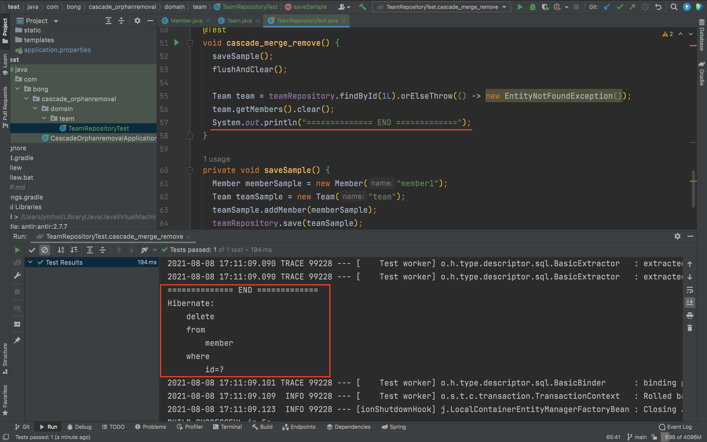
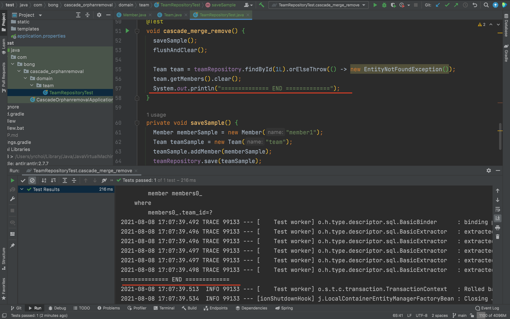

# JPA

## Debug

### 이슈 내용

- 현업에서 작업중, `cascade = CascadeType.REMOVE, orphanRemoval = true` 조건이 걸린 OneToMany 관계의 데이터에 대하여 `clear()` 시 Delete 쿼리가 나가지 않아 제대로 동작하지 않는것을 발견했다.

- 해당 엔티티를 재현해보면 아래와 같았다.

  ```java
  @Entity
  @Getter
  @NoArgsConstructor(access = AccessLevel.PROTECTED)
  public class Team {
  
    @Id
    @GeneratedValue
    private Long id;
  
    @Column(name = "name", length = 50)
    private String name;
  
    @OneToMany(mappedBy = "team", cascade = CascadeType.REMOVE, orphanRemoval = true)
    private List<Member> members = new ArrayList<>();
    
  }
  ```

    - 양방향 관계
    - OneToMany (주인이 아닌 종속)
    - CascadeType.REMOVE
    - orphanRemoval=true

- Persist ALL에 대하여는 정상 동작하는것을 확인하였다.


### 해결과정

- persist, merge, remove 에 대하여 모두 테스틀 해보았다.

    - 고아객체 삭제에 대해서만 테스트 하였다.
      team 데이터가 지워지는 경우에 대해서는 테스트하지 않았다.

    - 테스트 코드

      ```java
      @Test
      void cascade_merge_remove() {
        saveSample();
        flushAndClear();
      
        Team team = teamRepository.findById(1L).orElseThrow(() -> new EntityNotFoundException());
        team.getMembers().clear();
      }
      ```

    - PERSIST : 정상

      

    - MERGE : Delete 누락

      

    - RMOEVE : Delete 누락 (위와 동)

- PERSIST 일때만 정상 동작하는것을 확인

- **clear 가 아닌 리스트 내 객체를 remove 시에도 teamId를 null로 update쿼리가 발생하며, delete 쿼리가 발생하지 않았다.**


### 해결

- 구글링 중 JPA의 이슈 트래커에서 관련내용을 찾았다는 블로그글을 확인했다.
    - [삽질로그](https://velog.io/@woodyn1002/%EC%82%BD%EC%A7%88-%EB%A1%9C%EA%B7%B8-CascadeType.PERSIST%EA%B0%80-%EC%97%86%EC%9C%BC%EB%A9%B4orphanRemoval%EC%9D%B4-%EC%9E%91%EB%8F%99%ED%95%98%EC%A7%80-%EC%95%8A%EB%8A%94-%EB%AC%B8%EC%A0%9C)
    - https://hibernate.atlassian.net/browse/HHH-9571
- 해당버그는 수정되었었으나 다시 롤백되었다고 한다.
    - JPA 스펙에 의하면 OneToOne 관계에서 `cascade=PERSIST` 를 걸어두지 않았을 때 자식이 Transient 상태이면 IllegalStateException이 던져져야 하는데, orphanRemoval 버그를 수정시 정상동작 하지 않음.
- 해당 이슈는 2015년에 등록된 이슈로 6년동안 해결이 안된것으로 보아 해결되지 않을것으로 예상된다.
- 결론은 orphanRemoval을 적용하기 위해서는 CascadeType.PERSIST를 포함시켜야한다.
    - 기준 버전 5.4.27 Final


### 참고

- [삽질로그](https://velog.io/@woodyn1002/%EC%82%BD%EC%A7%88-%EB%A1%9C%EA%B7%B8-CascadeType.PERSIST%EA%B0%80-%EC%97%86%EC%9C%BC%EB%A9%B4orphanRemoval%EC%9D%B4-%EC%9E%91%EB%8F%99%ED%95%98%EC%A7%80-%EC%95%8A%EB%8A%94-%EB%AC%B8%EC%A0%9C)
- https://hibernate.atlassian.net/browse/HHH-9571

---

